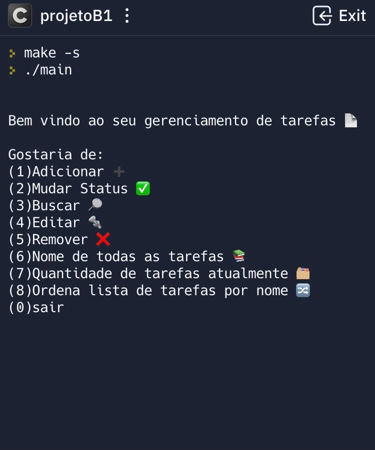
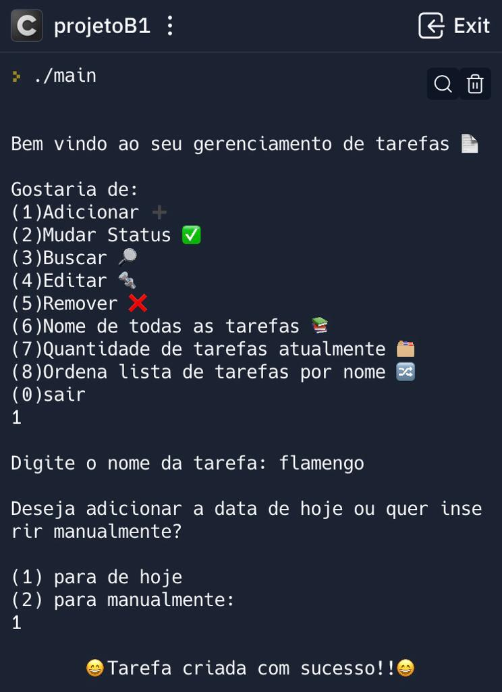
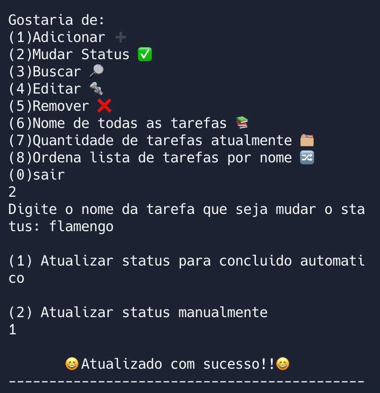
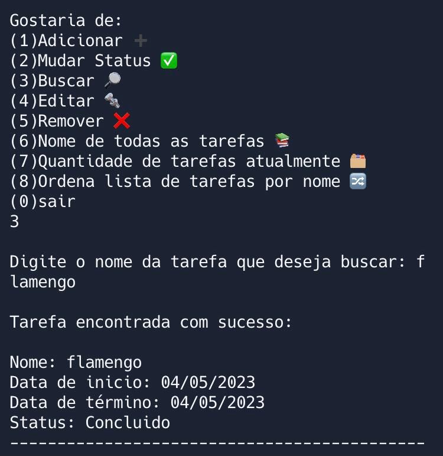
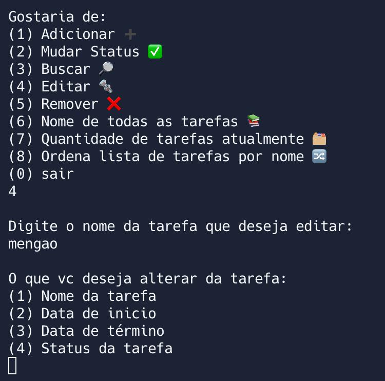
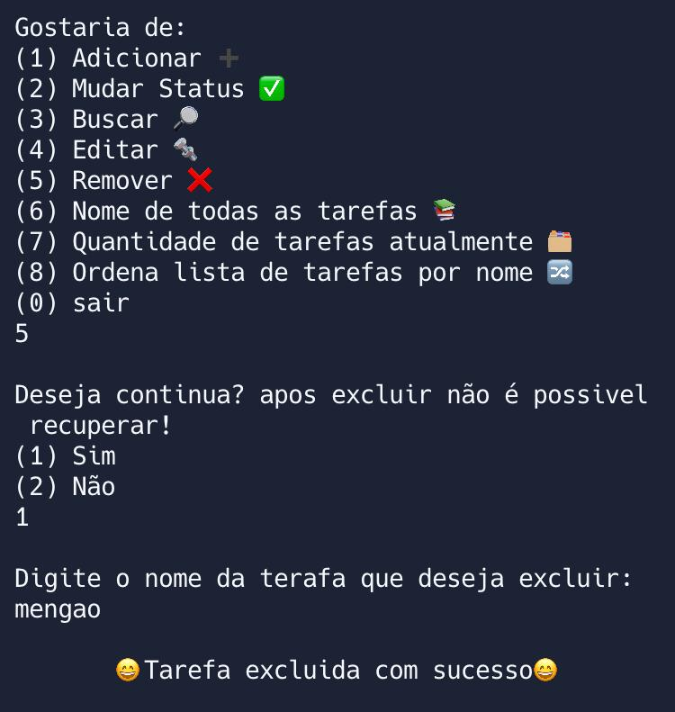
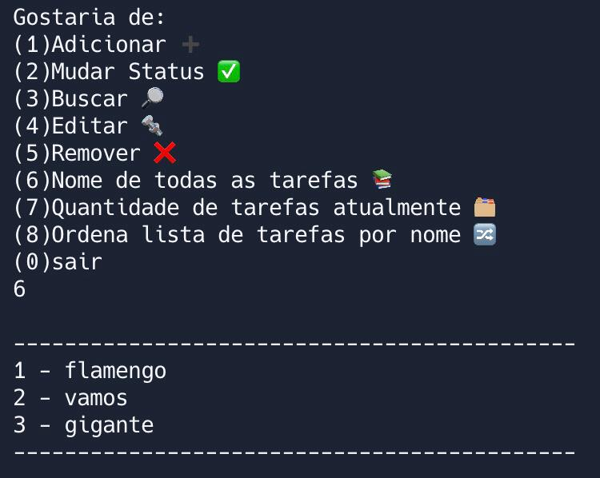
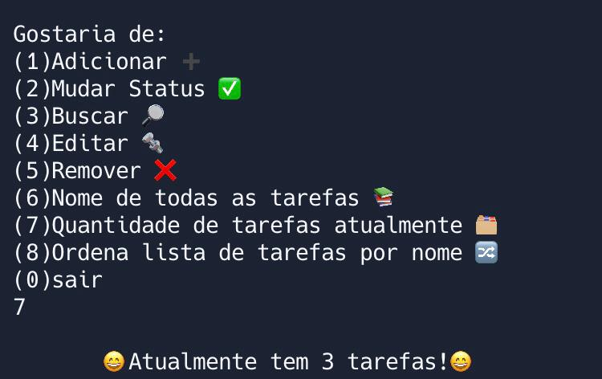
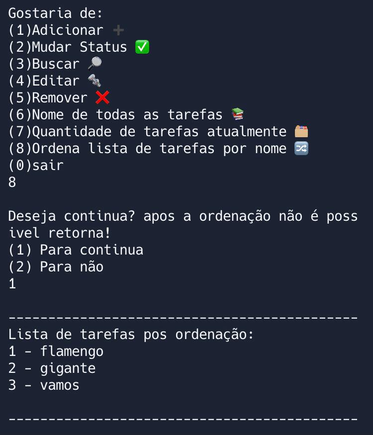

<h1 align="center"> Gerenciador de tarefas </h1>

 

  <a href="#-tecnologias">Tecnologias</a>&nbsp;&nbsp;&nbsp;|&nbsp;&nbsp;&nbsp;
  <a href="#-projeto">Projeto</a>&nbsp;&nbsp;&nbsp;|&nbsp;&nbsp;&nbsp;
  <a href="#memo-licença">Licença</a>&nbsp;&nbsp;&nbsp;|&nbsp;&nbsp;&nbsp;

  

 

## 🚀 Tecnologias

Esse projeto foi desenvolvido com as seguintes tecnologias:

- Linguagem C

## 💻 Projeto

<strong>MENU</strong>  
 
O programa começa imprimindo uma mensagem de boas-vindas e em seguida exibe o menu de opções em um loop "do-while" que executa repetidamente até que o usuário escolha a opção de sair (opção 0). O loop "do-while" é usado aqui porque a lógica do programa precisa ser executada pelo menos uma vez, independentemente da escolha do usuário. Cada opção é associada a uma função específica que realiza a ação correspondente. O programa recebe a entrada do usuário por meio da função "scanf()" e usa a função "getchar()" para limpar o buffer de entrada após a leitura. Se o usuário selecionar uma opção inválida, o programa imprime uma mensagem de erro e retorna ao menu de opções. Quando o usuário seleciona a opção de sair (opção 0), o loop "do-while" termina e o programa é encerrado.
 

##

<strong>ADICIONAR</strong>  
 
A função adicionarTarefa() é responsável por adicionar uma nova tarefa à lista de tarefas. Ela inicia criando uma nova estrutura do tipo struct tarefa chamada novaTarefa. Em seguida, ela solicita que o usuário digite o nome da tarefa usando scanf() e limpa o buffer com getchar().

A função então oferece ao usuário a opção de adicionar a data de início manualmente ou usar a data atual. Se o usuário escolher a opção de usar a data atual, a função usa a biblioteca time.h para obter a data e hora atuais em segundos, converte para o formato atual usando localtime() e formata a data usando sprintf() antes de armazená-la em novaTarefa.dataInicio. A data de término é inicializada como vazia usando novaTarefa.dataTermino[0] = '\0', e o status é definido como "Em Progresso..." usando strcpy().

Se o usuário escolher a opção de adicionar a data manualmente, a função solicita que o usuário digite a data de início usando scanf(), armazena a data em novaTarefa.dataInicio e inicializa a data de término e o status como vazios.

Por fim, a nova tarefa é adicionada à lista de tarefas listaTarefas e o número total de tarefas numTarefas é incrementado. A função exibe uma mensagem indicando que a tarefa foi criada com sucesso.
 

##

<strong>MUDAR STATUS</strong>  
 
A função mudarStatus() é responsável por mudar o status de uma tarefa existente na lista de tarefas. Ela começa solicitando o nome da tarefa que se deseja mudar o status. Em seguida, busca pelo nome na lista de tarefas para obter a posição da tarefa na lista. Depois disso, ela exibe duas opções para atualizar o status da tarefa: (1) Atualizar status para concluído automaticamente ou (2) Atualizar status manualmente.

Se a opção escolhida for 1, o status da tarefa é atualizado automaticamente para "Concluído" e a data de término é armazenada com a data atual. Se a opção escolhida for 2, a função solicita que o usuário digite a nova data de término e o novo status da tarefa, que são armazenados na estrutura da tarefa correspondente.

Ao final, a função exibe uma mensagem indicando se a atualização foi realizada com sucesso ou se a decisão foi inválida.
 

##

<strong>BUSCAR TAREFA</strong>  
 
A função "buscarTarefa", que busca por uma tarefa específica em uma lista de tarefas.

A função começa pedindo ao usuário que digite o nome da tarefa que deseja buscar. Em seguida, um loop "for" é executado para percorrer cada elemento da lista de tarefas.

Dentro desse loop, a função strcmp é usada para comparar o nome da tarefa atual com o nome da tarefa digitada pelo usuário. Se for encontrado uma correspondência, a função imprime as informações da tarefa (nome, data de início, data de término e status) e uma flag "encontrou" é configurada para "1" indicando que a tarefa foi encontrada.

Se a tarefa não for encontrada, a função imprime uma mensagem indicando que a tarefa não foi encontrada. Por fim, a função imprime uma linha separadora para melhor visualização dos resultados.
 

##

<strong>EDITAR TAREFA</strong>  
 
A função "editarTarefa" permite ao usuário editar os dados de uma tarefa existente. Ela solicita o nome da tarefa que deseja editar e busca na lista de tarefas salvas até encontrar a correspondente. Caso encontre, o usuário pode digitar um novo nome, data de início, data de término e status para a tarefa. Em seguida, os dados da tarefa são atualizados e a função exibe uma mensagem indicando que a atualização foi concluída com sucesso. Caso a tarefa não seja encontrada na lista, a função exibe uma mensagem informando que a tarefa não foi encontrada.
 

##

<strong>REMOVER TAREFA</strong>  
 
A função removerTarefa é responsável por excluir uma tarefa da lista de tarefas armazenada no programa. Ela recebe como entrada o nome da tarefa a ser excluída e, em seguida, percorre a lista de tarefas até encontrar a posição da tarefa que possui o nome especificado. Caso a tarefa não seja encontrada, a função exibe uma mensagem indicando que a tarefa não foi encontrada. Caso contrário, a função remove a tarefa, deslocando as tarefas seguintes uma posição para a esquerda, e diminui o número total de tarefas armazenadas no programa. Por fim, a função exibe uma mensagem indicando que a tarefa foi excluída com sucesso
 

##

<strong>NOME DAS TAREFAS</strong>  
 
A função "nomeTodasT" tem como objetivo imprimir na tela o nome de todas as tarefas armazenadas na listaTarefas. A função percorre o array de estruturas "listaTarefas" utilizando um loop e a cada iteração, imprime o número da tarefa (i + 1) e seu respectivo nome. Ao final, é impressa uma linha de separação para melhorar a visualização dos resultados. Essa função não realiza nenhuma modificação nos valores dos atributos da estrutura ou na lista de tarefas em si.
 

##

<strong>QUANTIDADE DE TAREFAS</strong>  
 
A função "quantasTarefas" recebe como parâmetro um ponteiro para inteiro. Ela percorre a lista de tarefas e conta quantas tarefas não estão vazias (ou seja, cujo nome não é uma string vazia). O resultado é armazenado na variável local "cont". Em seguida, o valor de "cont" é atribuído ao valor apontado pelo ponteiro passado como argumento, permitindo que o valor seja utilizado na função que chamou "quantasTarefas"
 

##

<strong>ORDENA TAREFAS</strong>  
 
Para fazer essa ordenação usamos duas funções: 
A função comparar é usada como parâmetro na função qsort, que é responsável por ordenar um array. Essa função recebe dois ponteiros genéricos (void) como parâmetros, que representam dois elementos do array que serão comparados para determinar a ordem de classificação.

Na função comparar, os ponteiros genéricos são convertidos para ponteiros do tipo struct tarefa, que é a estrutura utilizada para armazenar as informações das tarefas. Em seguida, a função compara os nomes das tarefas utilizando a função strcmp, que retorna um valor negativo se a primeira string for menor que a segunda, um valor positivo se a primeira string for maior que a segunda e zero se as duas strings forem iguais.

A função ordena chama a função qsort, passando como parâmetros o array listaTarefas, o número de elementos desse array (numTarefas), o tamanho de cada elemento (sizeof(struct tarefa)) e a função comparar. Após a ordenação, a função imprime a lista de tarefas ordenada pelo nome.
 

 

## 👋 Licença

Esse projeto está sob a licença MIT.
